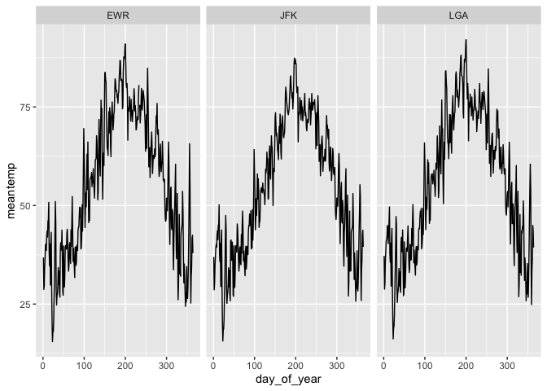

Practice Exam
=============

This practice exam asks you to do several code wrangling tasks that we
have done in class so far.

Clone this repo into Rstudio and fill in the necessary code. Then,
commit and push to github. Finally, turn in a link to canvas.

    ## ── Attaching packages ────────────────────────────────────────────────────────── tidyverse 1.2.1 ──

    ## ✔ ggplot2 3.2.1     ✔ purrr   0.3.2
    ## ✔ tibble  2.1.3     ✔ dplyr   0.8.4
    ## ✔ tidyr   1.0.0     ✔ stringr 1.4.0
    ## ✔ readr   1.3.1     ✔ forcats 0.4.0

    ## ── Conflicts ───────────────────────────────────────────────────────────── tidyverse_conflicts() ──
    ## ✖ dplyr::filter() masks stats::filter()
    ## ✖ dplyr::lag()    masks stats::lag()

Make a plot with three facets, one for each airport in the weather data.
The x-axis should be the day of the year (1:365) and the y-axis should
be the mean temperature recorded on that day, at that airport.

    library(lubridate)

    ## 
    ## Attaching package: 'lubridate'

    ## The following object is masked from 'package:base':
    ## 
    ##     date

    weather %>% mutate(day_of_year = yday(time_hour)) %>% 
      select(origin,temp,day_of_year) %>% 
      group_by(origin,day_of_year) %>% 
      summarise(meantemp = mean(temp)) %>% 
      ggplot() + 
      geom_line(mapping = aes(x=day_of_year,y=meantemp)) + 
      facet_wrap(~origin)

Make a non-tidy matrix of that data where each row is an airport and
each column is a day of the year.

    weather %>% mutate(day_of_year = yday(time_hour)) %>% 
      group_by(origin,day_of_year) %>% 
      summarise(meantemp = mean(temp,na.rm = T)) %>% 
      pivot_wider(names_from = day_of_year, values_from = meantemp)

    ## # A tibble: 3 x 365
    ## # Groups:   origin [3]
    ##   origin   `1`   `2`   `3`   `4`   `5`   `6`   `7`   `8`   `9`  `10`  `11`
    ##   <chr>  <dbl> <dbl> <dbl> <dbl> <dbl> <dbl> <dbl> <dbl> <dbl> <dbl> <dbl>
    ## 1 EWR     36.8  28.7  29.6  34.3  36.6  39.9  40.3  38.6  42.1  43.6  42.0
    ## 2 JFK     36.9  28.6  30.1  34.7  36.8  39.3  40.1  39.4  42.7  43.6  41.3
    ## 3 LGA     37.2  28.8  30.3  35.8  38.3  41.0  41.4  42.3  44.9  44.3  40.3
    ## # … with 353 more variables: `12` <dbl>, `13` <dbl>, `14` <dbl>,
    ## #   `15` <dbl>, `16` <dbl>, `17` <dbl>, `18` <dbl>, `19` <dbl>,
    ## #   `20` <dbl>, `21` <dbl>, `22` <dbl>, `23` <dbl>, `24` <dbl>,
    ## #   `25` <dbl>, `26` <dbl>, `27` <dbl>, `28` <dbl>, `29` <dbl>,
    ## #   `30` <dbl>, `31` <dbl>, `32` <dbl>, `33` <dbl>, `34` <dbl>,
    ## #   `35` <dbl>, `36` <dbl>, `37` <dbl>, `38` <dbl>, `39` <dbl>,
    ## #   `40` <dbl>, `41` <dbl>, `42` <dbl>, `43` <dbl>, `44` <dbl>,
    ## #   `45` <dbl>, `46` <dbl>, `47` <dbl>, `48` <dbl>, `49` <dbl>,
    ## #   `50` <dbl>, `51` <dbl>, `52` <dbl>, `53` <dbl>, `54` <dbl>,
    ## #   `55` <dbl>, `56` <dbl>, `57` <dbl>, `58` <dbl>, `59` <dbl>,
    ## #   `60` <dbl>, `61` <dbl>, `62` <dbl>, `63` <dbl>, `64` <dbl>,
    ## #   `65` <dbl>, `66` <dbl>, `67` <dbl>, `68` <dbl>, `69` <dbl>,
    ## #   `70` <dbl>, `71` <dbl>, `72` <dbl>, `73` <dbl>, `74` <dbl>,
    ## #   `75` <dbl>, `76` <dbl>, `77` <dbl>, `78` <dbl>, `79` <dbl>,
    ## #   `80` <dbl>, `81` <dbl>, `82` <dbl>, `83` <dbl>, `84` <dbl>,
    ## #   `85` <dbl>, `86` <dbl>, `87` <dbl>, `88` <dbl>, `89` <dbl>,
    ## #   `90` <dbl>, `91` <dbl>, `92` <dbl>, `93` <dbl>, `94` <dbl>,
    ## #   `95` <dbl>, `96` <dbl>, `97` <dbl>, `98` <dbl>, `99` <dbl>,
    ## #   `100` <dbl>, `101` <dbl>, `102` <dbl>, `103` <dbl>, `104` <dbl>,
    ## #   `105` <dbl>, `106` <dbl>, `107` <dbl>, `108` <dbl>, `109` <dbl>,
    ## #   `110` <dbl>, `111` <dbl>, …

For each (airport, day) contruct a tidy data set of the airport’s
“performance” as the proportion of flights that departed less than an
hour late.

    perf = flights %>% mutate(day_of_year = yday(time_hour)) %>% 
      group_by(origin, day_of_year) %>% 
      summarize(performance = mean(dep_delay<60, na.rm = T)) 
    perf

    ## # A tibble: 1,095 x 3
    ## # Groups:   origin [3]
    ##    origin day_of_year performance
    ##    <chr>        <dbl>       <dbl>
    ##  1 EWR              1       0.918
    ##  2 EWR              2       0.837
    ##  3 EWR              3       0.979
    ##  4 EWR              4       0.935
    ##  5 EWR              5       0.966
    ##  6 EWR              6       0.95 
    ##  7 EWR              7       0.921
    ##  8 EWR              8       0.982
    ##  9 EWR              9       0.976
    ## 10 EWR             10       0.980
    ## # … with 1,085 more rows

Construct a tidy data set to that give weather summaries for each
(airport, day). Use the total precipitation, minimum visibility, maximum
wind\_gust, and average wind\_speed.

    weat = weather %>% mutate(day_of_year = yday(time_hour)) %>%
      select(origin,day_of_year,precip,visib,wind_gust,wind_speed) %>% 
      filter(!is.na(wind_gust))%>% 
      group_by(origin,day_of_year) %>% 
      summarise(totalprecip = sum(precip,na.rm = T),
                minvisib=min(visib,na.rm = T),
                maxwind_gust=max(wind_gust,na.rm = T),
                avewind_speed=mean(wind_speed,na.rm = T))
    weat

    ## # A tibble: 797 x 6
    ## # Groups:   origin [3]
    ##    origin day_of_year totalprecip minvisib maxwind_gust avewind_speed
    ##    <chr>        <dbl>       <dbl>    <dbl>        <dbl>         <dbl>
    ##  1 EWR              1           0     10           26.5          15.8
    ##  2 EWR              2           0     10           26.5          13.8
    ##  3 EWR              4           0     10           31.1          18.0
    ##  4 EWR              5           0     10           26.5          12.3
    ##  5 EWR              6           0     10           19.6          14.4
    ##  6 EWR              7           0     10           24.2          13.3
    ##  7 EWR              8           0     10           25.3          15.0
    ##  8 EWR              9           0      9           20.7          12.7
    ##  9 EWR             10           0     10           26.5          12.8
    ## 10 EWR             14           0      0.5         27.6          10.6
    ## # … with 787 more rows

Construct a linear model to predict the performance of each
(airport,day) using the weather summaries and a “fixed effect” for each
airport. Display the summaries.

    dat = left_join(weat,perf)

    ## Joining, by = c("origin", "day_of_year")

    dat

    ## # A tibble: 797 x 7
    ## # Groups:   origin [3]
    ##    origin day_of_year totalprecip minvisib maxwind_gust avewind_speed
    ##    <chr>        <dbl>       <dbl>    <dbl>        <dbl>         <dbl>
    ##  1 EWR              1           0     10           26.5          15.8
    ##  2 EWR              2           0     10           26.5          13.8
    ##  3 EWR              4           0     10           31.1          18.0
    ##  4 EWR              5           0     10           26.5          12.3
    ##  5 EWR              6           0     10           19.6          14.4
    ##  6 EWR              7           0     10           24.2          13.3
    ##  7 EWR              8           0     10           25.3          15.0
    ##  8 EWR              9           0      9           20.7          12.7
    ##  9 EWR             10           0     10           26.5          12.8
    ## 10 EWR             14           0      0.5         27.6          10.6
    ## # … with 787 more rows, and 1 more variable: performance <dbl>

    mymodel = lm(performance ~ origin+totalprecip+minvisib+maxwind_gust+avewind_speed,data = dat)
    summary(mymodel)

    ## 
    ## Call:
    ## lm(formula = performance ~ origin + totalprecip + minvisib + 
    ##     maxwind_gust + avewind_speed, data = dat)
    ## 
    ## Residuals:
    ##      Min       1Q   Median       3Q      Max 
    ## -0.44659 -0.01459  0.02227  0.04153  0.18265 
    ## 
    ## Coefficients:
    ##                 Estimate Std. Error t value Pr(>|t|)    
    ## (Intercept)    0.8101512  0.0189462  42.761  < 2e-16 ***
    ## originJFK      0.0244107  0.0071047   3.436 0.000621 ***
    ## originLGA      0.0224473  0.0062254   3.606 0.000331 ***
    ## totalprecip   -0.0171632  0.0226214  -0.759 0.448249    
    ## minvisib       0.0120740  0.0013632   8.857  < 2e-16 ***
    ## maxwind_gust   0.0004262  0.0007042   0.605 0.545242    
    ## avewind_speed -0.0018022  0.0013687  -1.317 0.188319    
    ## ---
    ## Signif. codes:  0 '***' 0.001 '**' 0.01 '*' 0.05 '.' 0.1 ' ' 1
    ## 
    ## Residual standard error: 0.07327 on 790 degrees of freedom
    ## Multiple R-squared:  0.1741, Adjusted R-squared:  0.1678 
    ## F-statistic: 27.76 on 6 and 790 DF,  p-value: < 2.2e-16

Repeat the above, but only for EWR. Obviously, exclude the fixed effect
for each airport.

    datEWR = filter(dat,origin == "EWR")
    mymodelEWR = lm(performance ~ totalprecip+minvisib+maxwind_gust+avewind_speed,data = datEWR)
    summary(mymodelEWR)

    ## 
    ## Call:
    ## lm(formula = performance ~ totalprecip + minvisib + maxwind_gust + 
    ##     avewind_speed, data = datEWR)
    ## 
    ## Residuals:
    ##      Min       1Q   Median       3Q      Max 
    ## -0.45000 -0.02082  0.02357  0.05175  0.16657 
    ## 
    ## Coefficients:
    ##                 Estimate Std. Error t value Pr(>|t|)    
    ## (Intercept)    0.8534293  0.0342227  24.938  < 2e-16 ***
    ## totalprecip   -0.0155757  0.0432116  -0.360    0.719    
    ## minvisib       0.0110473  0.0026204   4.216 3.41e-05 ***
    ## maxwind_gust  -0.0004943  0.0014079  -0.351    0.726    
    ## avewind_speed -0.0025065  0.0028284  -0.886    0.376    
    ## ---
    ## Signif. codes:  0 '***' 0.001 '**' 0.01 '*' 0.05 '.' 0.1 ' ' 1
    ## 
    ## Residual standard error: 0.08004 on 268 degrees of freedom
    ## Multiple R-squared:  0.1269, Adjusted R-squared:  0.1139 
    ## F-statistic: 9.738 on 4 and 268 DF,  p-value: 2.279e-07
